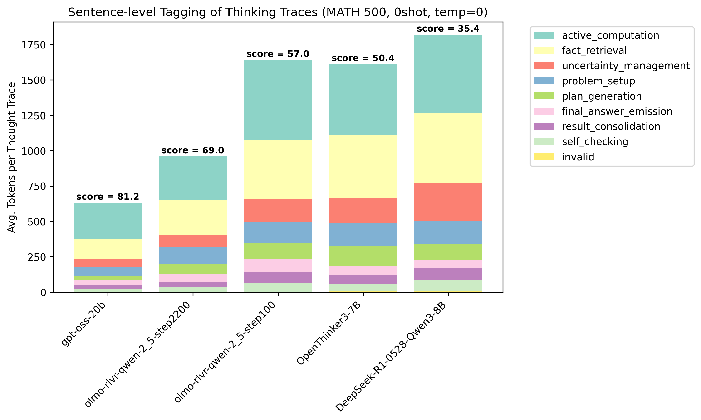
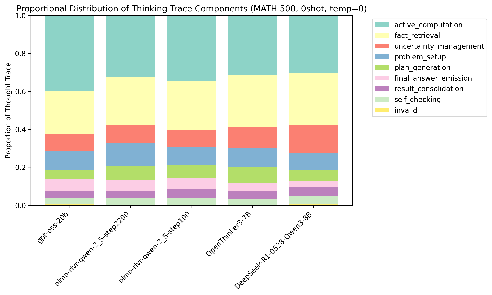

### setup

```sh
pip install -r requirements.txt

# Spacy for sentence segmentation
pip install https://github.com/explosion/spacy-models/releases/download/en_core_web_sm-3.7.1/en_core_web_sm-3.7.1-py3-none-any.whl
```

<details>
<summary>GPT OSS Install</summary>

```sh
# GPT OSS requires pre-release vLLM
# https://cookbook.openai.com/articles/gpt-oss/run-vllm
uv pip install --pre vllm==0.10.1+gptoss \
    --extra-index-url https://wheels.vllm.ai/gpt-oss/ \
    --extra-index-url https://download.pytorch.org/whl/nightly/cu128 \
    --index-strategy unsafe-best-match

# ... and install flash infer
uv pip install --system https://download.pytorch.org/whl/cu128/flashinfer/flashinfer_python-0.2.6.post1%2Bcu128torch2.7-cp39-abi3-linux_x86_64.whl
```

</details>

**Run eval**

```sh
minieval -t minerva_500:cot -m deepseek-ai/DeepSeek-R1-0528-Qwen3-8B -b vllm --writer.save_path out/DeepSeek-R1-0528-Qwen3-8B
minieval -t minerva_500:cot -m open-thoughts/OpenThinker3-7B -b vllm --writer.save_path out/OpenThinker3-7B
minieval -t minerva_500:cot -m Qwen/Qwen3-30B-A3B-Thinking-2507 -b vllm --writer.save_path out/Qwen3-30B-A3B-Thinking-2507

# Args required for A100, not for H100
VLLM_ATTENTION_BACKEND=TRITON_ATTN_VLLM_V1 TORCH_CUDA_ARCH_LIST=8.0 minieval -t minerva_500:cot -m openai/gpt-oss-20b -b vllm --writer.save_path out/gpt-oss-20b
```

<details>
<summary>Additional models</summary>

```sh
open-thoughts/OpenThinker3-7B
Qwen/Qwen3-235B-A22B-Thinking-2507
Qwen/Qwen3-30B-A3B-Thinking-2507
deepseek-ai/DeepSeek-R1
deepseek-ai/DeepSeek-R1-0528
deepseek-ai/DeepSeek-R1-Distill-Qwen-32B
deepseek-ai/DeepSeek-R1-0528-Qwen3-8B
moonshotai/Kimi-K2-Instruct
openai/gpt-oss-20b
openai/gpt-oss-120b
```

</details>

**Annotate reasoning trace (per-sentence)**

```sh
# Use GPT to annotate (~1M input tokens per trace)
python src/annotate_sentences.py -t minerva_500:cot -m OpenThinker3-7B
python src/annotate_sentences.py -t minerva_500:cot -m DeepSeek-R1-0528-Qwen3-8B
python src/annotate_sentences.py -t minerva_500:cot -m gpt-oss-20b
```

**Local models**

```sh
# see checkpoints
tree -L 2 /oe-eval-default/ai2-llm/checkpoints/davidh/OLMo-RLVR/

# eval
minieval -t minerva_500:cot -m /oe-eval-default/ai2-llm/checkpoints/davidh/OLMo-RLVR/1806rl_qwen2_5_integration_mix_12022__1__1750443080_checkpoints/step_100 -b vllm --writer.save_path out/olmo-rlvr-qwen-2_5-step100
minieval -t minerva_500:cot -m /oe-eval-default/ai2-llm/checkpoints/davidh/OLMo-RLVR/1806rl_qwen2_5_integration_mix_12022__1__1750443080_checkpoints/step_2200 -b vllm --writer.save_path out/olmo-rlvr-qwen-2_5-step2200

# annotate
python src/annotate_sentences.py -t minerva_500:cot -m olmo-rlvr-qwen-2_5-step100
python src/annotate_sentences.py -t minerva_500:cot -m olmo-rlvr-qwen-2_5-step2200
```

<details>
<summary>Token-level annotation</summary>

**Run vLLM server**

```sh
vllm serve Qwen/Qwen3-32B --port 8000 --max-model-len 32768
```

**Annotate reasoning trace (per-token, custom decoder)**

```sh
# Custom decoder that re-generates the same output, but allows tagging:
    # "Compute 2+3=5.\n" ==> "[problem_setup]Compute 2+3=5.[/problem_setup]"
python src/annotate_constrained.py # currently 6 TPS on 4o mini (40 minutes for 1 13K token trace)

# run in background
nohup python src/annotate_constrained.py > /tmp/out.out 2>&1 &
```

</details>

### Visualize

```sh
python analysis/distribution.py
```





### More ideas

- Fixes:
    - can we split "active computation" into computation for the original answer vs. checking the answer?

- How do trends look:
    - for intermediate RL steps?
    - for different amounts of GPT OSS reasoning?
    - for different tasks?
    - for the subset of tasks with lots of tokens? a small amount of tokens?

- Different properties of traces
    - what % is spent developing towards the correct answers? compared to computation that is effectively thrown away?
    - how many tokens in is the final answer suggested? (i.e., how long is spent checking the answer?)
